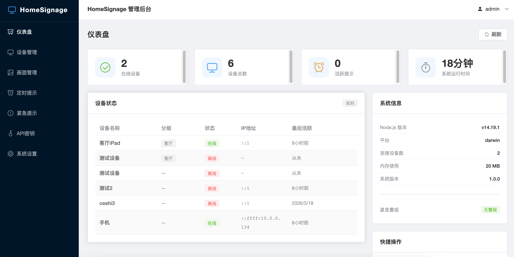
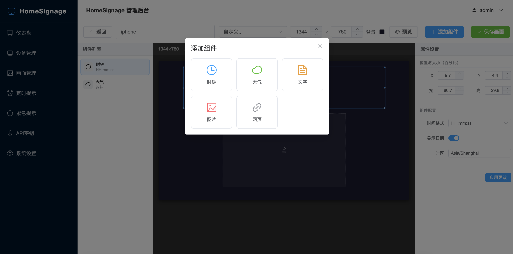
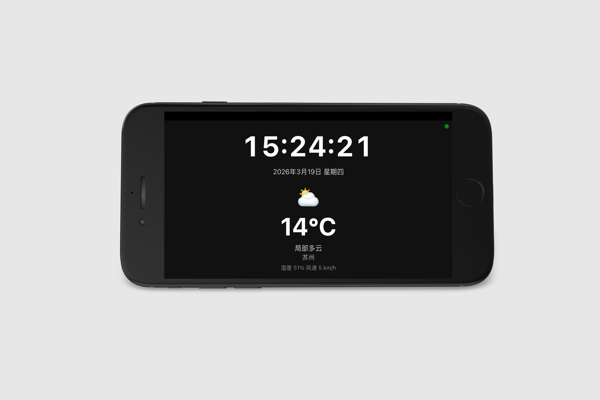
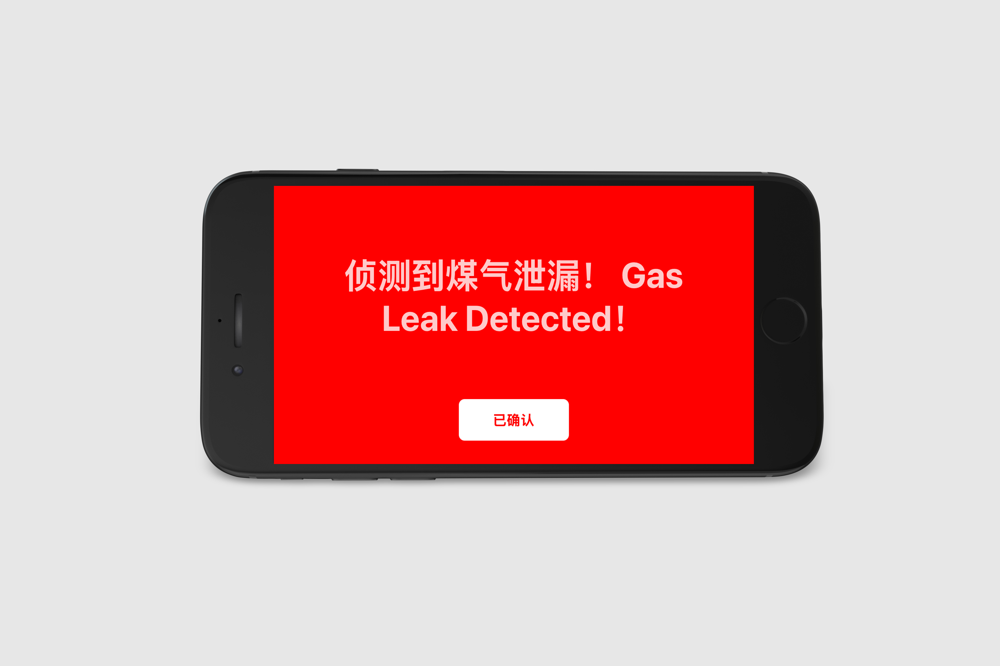

# HomeSignage

**English** | [中文](#中文)

> Turn idle phones, tablets, and old laptops into smart home information displays.

HomeSignage is a self-hosted digital signage system for the home. It supports multi-scene carousels, timed overlays, emergency alerts, real-time weather, and a full REST API for integration with home automation systems like HomeAssistant.

---

## Screenshots

| Admin Dashboard | Scene Editor |
|:-:|:-:|
|  |  |

| Device Display | Emergency Alert |
|:-:|:-:|
|  |  |

---

## Features

- **Multi-scene carousel** — Each device shows multiple scenes in rotation with fade transitions
- **Rich components** — Clock, weather (auto-fetched, no API key required), text, image, iframe, info list
- **Info list** — A shared bulletin board of timestamped items (info / important / urgent) shown across all scenes; supports horizontal marquee and paginated display with fade transitions
- **Timed reminders** — Overlay banners on a schedule: daily / weekdays / weekends / one-time
- **Emergency alerts** — Full-screen red alert pushed to all devices in under 2 seconds, with looping audio
- **Real-time updates** — Info list changes are pushed instantly to all displays via Socket.IO
- **Offline resilience** — Devices fall back to cached content when the network is unavailable
- **Open REST API** — Control content and trigger alerts from external systems using API keys
- **Web admin UI** — Vue.js dashboard to manage all devices, scenes, and reminders

---

## Quick Start

### Option 1: Docker (recommended)

```bash
git clone <repo-url>
cd HomeSignage

cp .env.example .env          # edit .env — set JWT_SECRET at minimum

docker-compose up -d
docker-compose logs -f
```

### Option 2: Local Node.js

**Requires**: Node.js v16+

```bash
npm install
cd admin && npm install && npm run build && cd ..

cp .env.example .env          # edit .env — set JWT_SECRET at minimum

npm start
```

Once running:
- Admin UI → `http://localhost:3000/admin`
- Display client → `http://localhost:3000/client`
- API docs (Swagger) → `http://localhost:3000/api/docs`

---

## Environment Variables

| Variable | Default | Description |
|----------|---------|-------------|
| `PORT` | `3000` | Server port |
| `JWT_SECRET` | *(required)* | JWT signing secret — use a random string |
| `SQLITE_PATH` | `./data/signage.db` | SQLite database path |
| `LOG_LEVEL` | `info` | Log level: `debug` / `info` / `warn` / `error` |
| `NODE_ENV` | `development` | Runtime environment |

---

## Setup Guide

### 1. Log in to the admin panel

Open `http://<server-ip>:3000/admin` and log in with the default credentials:

- Username: `admin`
- Password: `admin123`

> ⚠️ Change your password immediately in **System Settings** after first login.

---

### 2. Add display devices

1. Go to **Devices** → **Add Device**
2. Enter a name (e.g. "Living Room iPad") and optional group
3. After creation, copy the device URL shown:
   ```
   http://<server-ip>:3000/client?deviceId=xxx&deviceKey=xxx
   ```
4. Open this URL in the browser on your display device — use fullscreen / kiosk mode

> **iOS/iPadOS tip**: In Safari, tap Share → Add to Home Screen for a full-screen, chrome-free experience.

---

### 3. Create scenes

1. Go to **Scenes** → **New Scene**
2. Set the canvas resolution to match your display (presets included for common sizes)
3. Add components from the left panel:

| Component | Purpose | Key config |
|-----------|---------|------------|
| Clock | Current time and date | 24h/12h format, timezone |
| Weather | Live weather data | City name, °C / °F |
| Text | Notices, reminders | Content, font size, color |
| Image | Display a photo | Image URL |
| Webpage | Embed an external page | Target URL |
| Info List | Shared bulletin board fed from the global info-items list | Font, colors, scroll speed, page interval |

4. Drag components to position them, or enter x/y/width/height values (percentage-based)
5. Click **Save Scene**

---

### 4. Assign scenes to devices

1. Go to **Devices** → click **Scenes** on the target device
2. Check the scenes to display and set the duration (seconds) for each
3. Use the arrow buttons to set the carousel order
4. Save — the device will reload its config within 5 minutes (or immediately via **Refresh**)

---

### 5. Set up timed reminders (optional)

Go to **Timed Reminders** → **Create Reminder**

| Parameter | Description |
|-----------|-------------|
| Time window | Start and end time (e.g. 08:00 – 08:30) |
| Repeat | None / Daily / Weekdays / Weekends |
| Target devices | Which devices to show the reminder on |
| Content | Message text |
| Style | Top bar / Bottom bar / Center / Blink |
| Priority | 1–10 (higher = takes precedence when overlapping) |

Reminders overlay the scene carousel without interrupting it. Multiple reminders at the same position rotate with fade transitions.

**Examples**:
- Weekdays 08:00–08:15: "Don't forget your keys!"
- Daily 20:00–20:30: "Time to drink water"
- Weekends 09:00–09:30: "Trash day — take out the bins"

---

### 6. Manage info list items (optional)

Go to **Info List** in the sidebar to add, edit, or delete bulletin items.

| Field | Description |
|-------|-------------|
| Type | **Info** (blue) · **Important** (yellow) · **Urgent** (red) |
| Content | The message text to display |
| Start time | Leave blank to show immediately |
| End time | Leave blank for a permanent item; expired items are auto-removed |

Each scene that contains an **Info List** component shares the same global list of items. Per-component settings (font, background, scroll speed, page interval) are configured in the scene editor.

**Display behaviour**:
- Two-column layout: coloured type badge on the left, message text on the right
- If text is wider than the component, it scrolls horizontally (left → right, seamless loop)
- If the list is taller than the component, it paginates with a configurable fade interval

Any change to the list is pushed instantly to all connected displays via Socket.IO.

---

### 7. Trigger emergency alerts (optional)

1. Go to **Emergency Alerts** → **Trigger Alert**
2. Write the alert message and choose target devices
3. Click **Trigger** — all target devices immediately go full-screen red
4. Click **Clear** when the situation is resolved — devices return to normal

---

## API Integration

External systems (e.g. HomeAssistant, n8n) can control HomeSignage via REST API.

### Authentication

Generate an API key in the admin panel under **API Keys**, then include it in requests:

```
X-API-Key: your-api-key
```

### Examples

**Trigger an emergency alert**
```bash
curl -X POST http://<server>:3000/api/v1/reminders/emergency \
  -H "X-API-Key: your-key" \
  -H "Content-Type: application/json" \
  -d '{
    "device_ids": ["all"],
    "content": {
      "text": "Gas leak! Evacuate immediately!",
      "backgroundColor": "#FF0000",
      "textColor": "#FFFFFF",
      "blink": true
    },
    "sound": { "file": "alarm.mp3", "volume": 1.0, "loop": true }
  }'
```

**Clear an emergency alert**
```bash
curl -X DELETE http://<server>:3000/api/v1/reminders/emergency/<alertId> \
  -H "X-API-Key: your-key"
```

**Create a timed reminder**
```bash
curl -X POST http://<server>:3000/api/v1/reminders/timed \
  -H "X-API-Key: your-key" \
  -H "Content-Type: application/json" \
  -d '{
    "name": "Morning reminder",
    "device_ids": ["all"],
    "start_time": "08:00",
    "end_time": "08:30",
    "repeat": "weekday",
    "content": {
      "text": "Do not forget your wallet!",
      "style": "blink",
      "color": "#ffffff",
      "backgroundColor": "#ff6600"
    },
    "priority": 7
  }'
```

### API Reference

| Method | Path | Description |
|--------|------|-------------|
| GET | `/api/v1/devices` | List all devices |
| GET | `/api/v1/devices/:id/config` | Get device config (used by client) |
| PUT | `/api/v1/devices/:id/scenes` | Update device scene list |
| POST | `/api/v1/devices/:id/refresh` | Force device to reload config |
| GET | `/api/v1/scenes` | List all scenes |
| GET | `/api/v1/weather?city=Beijing` | Get live weather data |
| POST | `/api/v1/reminders/timed` | Create a timed reminder |
| PUT | `/api/v1/reminders/timed/:id` | Update a timed reminder |
| DELETE | `/api/v1/reminders/timed/:id` | Delete a timed reminder |
| POST | `/api/v1/reminders/emergency` | Trigger an emergency alert |
| DELETE | `/api/v1/reminders/emergency/:id` | Clear an emergency alert |
| GET | `/api/v1/reminders/emergency/active` | List active alerts |
| GET | `/api/v1/info-items` | List all info items (admin) |
| GET | `/api/v1/info-items/active` | List currently active items (display clients) |
| POST | `/api/v1/info-items` | Create an info item |
| PUT | `/api/v1/info-items/:id` | Update an info item |
| DELETE | `/api/v1/info-items/:id` | Delete an info item |

Full interactive docs available at `http://localhost:3000/api/docs`

---

## Architecture

```
HomeAssistant / n8n / External Systems
           ↓  REST API  (X-API-Key)
    Node.js + Express + Socket.IO
           ↓  HTTP + WebSocket
    ┌──────────────────────────────┐
    │  Display clients             │
    │  (iOS Safari, Android Chrome,│
    │   old laptops — Vanilla JS)  │
    └──────────────────────────────┘
    ┌──────────────────────────────┐
    │  Admin dashboard             │
    │  (Vue.js 3 + Element Plus)   │
    └──────────────────────────────┘
         SQLite  ·  node-schedule
```

**Display priority** (highest to lowest):
1. Emergency alert — full-screen, interrupts everything
2. Timed reminder — overlays the current scene
3. Scene carousel — normal operation

---

## Project Structure

```
HomeSignage/
├── src/               # Node.js backend
│   ├── index.js       # Entry point
│   ├── config/        # Database schema & init
│   ├── middleware/     # JWT & API key auth
│   ├── dao/           # SQLite data access layer
│   ├── services/      # Socket.IO, scheduler
│   ├── controllers/   # Business logic
│   └── routes/        # REST route definitions
├── client/            # Display client (Vanilla JS, iOS-compatible)
├── admin/             # Admin dashboard source (Vue.js 3)
├── admin-dist/        # Built admin dashboard
├── data/              # SQLite database
├── uploads/           # Uploaded images and audio
├── logs/              # Application logs
└── docker-compose.yml
```

---

## Development

```bash
# Terminal 1 — backend with hot reload
npm run dev

# Terminal 2 — admin dashboard with HMR
cd admin && npm run dev
# Open http://localhost:5173/admin
```

---

## Hardware

| Role | Recommended |
|------|-------------|
| Server | Home NAS, Raspberry Pi 4, any low-power mini PC |
| Display | Old iPad/iPhone, old Android tablet, old laptop connected to a monitor |

**Minimum server spec**: 1 CPU core · 512 MB RAM · 1 GB storage

---

---

# 中文

[English](#homesignage) | **中文**

> 将闲置的手机、平板、旧笔记本变成家庭信息展示屏。

HomeSignage 是一个自托管的家庭数字标牌系统，支持多画面轮播、定时提醒叠加、紧急警报推送、实时天气显示，并提供完整的 REST API 供家庭自动化系统（如 HomeAssistant）集成。

---

## 功能概览

- **多画面轮播** — 每台设备可配置多个画面按序轮播，淡入淡出切换
- **丰富组件** — 时钟、天气（自动获取，无需 API Key）、文本、图片、网页嵌入（iframe）、信息列表
- **信息列表** — 全局共享的公告条目（提示 / 重要 / 紧急三种类型），支持时效性显示；超宽文字横向滚动，超高内容自动分页淡入淡出
- **定时提醒** — 在指定时段叠加显示提醒条，支持每天 / 工作日 / 周末 / 单次
- **紧急警报** — 全屏红色警报，2 秒内推送到所有设备，循环播放警示音
- **实时推送** — 信息列表增删改后即时通过 Socket.IO 推送给所有显示设备
- **断网缓存** — 网络断开时显示本地缓存内容，不黑屏
- **开放 API** — 支持外部系统通过 API Key 控制内容和触发警报
- **管理后台** — Vue.js Web 界面，统一管理所有设备和内容

---

## 快速开始

### 方式一：Docker 部署（推荐）

```bash
git clone <repo-url>
cd HomeSignage

cp .env.example .env    # 编辑 .env，至少修改 JWT_SECRET

docker-compose up -d
docker-compose logs -f
```

### 方式二：本地直接运行

**环境要求**：Node.js v16+

```bash
npm install
cd admin && npm install && npm run build && cd ..

cp .env.example .env    # 编辑 .env，至少修改 JWT_SECRET

npm start
```

服务启动后访问：
- 管理后台：`http://localhost:3000/admin`
- 显示客户端：`http://localhost:3000/client`
- API 文档（Swagger）：`http://localhost:3000/api/docs`

---

## 环境变量

| 变量 | 默认值 | 说明 |
|------|--------|------|
| `PORT` | `3000` | 服务监听端口 |
| `JWT_SECRET` | *(必填)* | JWT 签名密钥，请设置为随机字符串 |
| `SQLITE_PATH` | `./data/signage.db` | 数据库文件路径 |
| `LOG_LEVEL` | `info` | 日志级别（debug/info/warn/error） |
| `NODE_ENV` | `development` | 运行环境 |

---

## 使用向导

### 第一步：登录管理后台

访问 `http://<服务器IP>:3000/admin`，使用默认账号登录：

- 用户名：`admin`
- 密码：`admin123`

> ⚠️ 首次登录后请立即在「系统设置」中修改密码。

---

### 第二步：添加显示设备

1. 进入**设备管理**页面，点击「添加设备」
2. 填写设备名称（如"客厅 iPad"）和分组（如"客厅"）
3. 创建成功后复制显示的**专属访问链接**：
   ```
   http://<服务器IP>:3000/client?deviceId=xxx&deviceKey=xxx
   ```
4. 在显示设备的浏览器中打开此链接，建议设置为**全屏 / Kiosk 模式**

> **iOS/iPadOS 提示**：在 Safari 中点击「分享」→「添加到主屏幕」，即可全屏无地址栏运行。

---

### 第三步：创建画面

1. 进入**画面管理**页面，点击「新建画面」
2. 设置画布分辨率以匹配显示设备（内置常用预设）
3. 在左侧面板添加组件：

| 组件类型 | 用途 | 主要配置 |
|----------|------|----------|
| 时钟 | 显示当前时间和日期 | 24h/12h 格式、时区 |
| 天气 | 实时天气（自动获取） | 城市名称、温度单位 |
| 文本 | 备忘录、公告等 | 内容、字号、颜色 |
| 图片 | 展示图片 | 图片 URL |
| 网页 | 嵌入外部网页 | 目标 URL |
| 信息列表 | 显示全局共享的公告条目 | 字号、颜色、背景、横向滚动速度、翻页间隔 |

4. 拖拽组件调整位置和大小，或输入 x/y/宽/高（百分比）精确定位
5. 点击「保存画面」

---

### 第四步：为设备分配画面

1. 在**设备管理**页面，点击目标设备的「画面」按钮
2. 勾选要显示的画面，设置每个画面的显示时长（秒）
3. 通过上下箭头调整轮播顺序
4. 保存后设备会在 5 分钟内（或点击「刷新」按钮后立即）切换

---

### 第五步：设置定时提醒（可选）

进入**定时提示**页面，点击「创建提示」

| 参数 | 说明 |
|------|------|
| 开始/结束时间 | 例如 08:00 – 08:30 |
| 重复规则 | 不重复 / 每天 / 工作日 / 周末 |
| 目标设备 | 选择哪些设备显示提醒 |
| 提示内容 | 显示的文字 |
| 显示样式 | 顶部条 / 底部条 / 居中浮窗 / 闪烁 |
| 优先级 | 1–10，同时段多条提醒时数字大的优先 |

提醒会**叠加**在画面轮播之上，同一位置有多条时淡入淡出轮播显示。

**使用示例**：
- 工作日 08:00–08:15：「记得带钥匙和饭盒！」
- 每天 20:00–20:30：「该喝水了」
- 周末 09:00–09:30：「今天是垃圾日，记得扔垃圾」

---

### 第六步：管理信息列表（可选）

进入侧边栏「**信息列表**」页面，添加、编辑或删除公告条目。

| 字段 | 说明 |
|------|------|
| 类型 | **提示**（蓝色）· **重要**（黄色）· **紧急**（红色） |
| 信息内容 | 要显示的文字 |
| 开始时间 | 不填则立即显示 |
| 结束时间 | 不填则永久保留；过期条目每小时自动清理 |

所有包含**信息列表组件**的画面共享同一套全局条目，每个组件可单独配置字体、背景、滚动速度和翻页间隔。

**显示效果**：
- 两列布局：左列为彩色类型标签，右列为信息文字
- 文字超出组件宽度时横向无缝滚动
- 条目超出组件高度时分页显示，页切换淡入淡出

对信息列表的任何修改都会**即时**通过 Socket.IO 推送给所有已连接的显示设备。

---

### 第七步：触发紧急警报（可选）

1. 进入**紧急提示**页面
2. 点击红色「触发紧急警报」按钮
3. 填写警报内容，选择目标设备
4. 点击「立即触发」— 目标设备立即全屏显示红色警报
5. 处理完毕后点击「解除警报」，设备恢复正常显示

---

## API 集成

外部系统（如 HomeAssistant、n8n）可通过 REST API 控制显示内容。

### 获取 API 密钥

在管理后台「API 密钥」页面生成密钥，在请求头中携带：

```
X-API-Key: your-api-key
```

### 常用 API 示例

**触发紧急警报**
```bash
curl -X POST http://<server>:3000/api/v1/reminders/emergency \
  -H "X-API-Key: your-key" \
  -H "Content-Type: application/json" \
  -d '{
    "device_ids": ["all"],
    "content": {
      "text": "煤气泄漏！请立即撤离！",
      "backgroundColor": "#FF0000",
      "textColor": "#FFFFFF",
      "blink": true
    },
    "sound": { "file": "alarm.mp3", "volume": 1.0, "loop": true }
  }'
```

**解除紧急警报**
```bash
curl -X DELETE http://<server>:3000/api/v1/reminders/emergency/<alertId> \
  -H "X-API-Key: your-key"
```

**创建定时提醒**
```bash
curl -X POST http://<server>:3000/api/v1/reminders/timed \
  -H "X-API-Key: your-key" \
  -H "Content-Type: application/json" \
  -d '{
    "name": "出门提醒",
    "device_ids": ["all"],
    "start_time": "08:00",
    "end_time": "08:30",
    "repeat": "weekday",
    "content": {
      "text": "记得带钱包！",
      "style": "blink",
      "color": "#ffffff",
      "backgroundColor": "#ff6600"
    },
    "priority": 7
  }'
```

### 完整 API 列表

| 方法 | 路径 | 说明 |
|------|------|------|
| GET | `/api/v1/devices` | 获取所有设备 |
| GET | `/api/v1/devices/:id/config` | 获取设备配置（客户端专用） |
| PUT | `/api/v1/devices/:id/scenes` | 更新设备画面列表 |
| POST | `/api/v1/devices/:id/refresh` | 强制设备刷新配置 |
| GET | `/api/v1/scenes` | 获取所有画面 |
| GET | `/api/v1/weather?city=北京` | 获取实时天气数据 |
| POST | `/api/v1/reminders/timed` | 创建定时提醒 |
| PUT | `/api/v1/reminders/timed/:id` | 更新定时提醒 |
| DELETE | `/api/v1/reminders/timed/:id` | 删除定时提醒 |
| POST | `/api/v1/reminders/emergency` | 触发紧急警报 |
| DELETE | `/api/v1/reminders/emergency/:id` | 解除紧急警报 |
| GET | `/api/v1/reminders/emergency/active` | 查询活跃警报 |
| GET | `/api/v1/info-items` | 获取所有信息条目（管理端） |
| GET | `/api/v1/info-items/active` | 获取当前有效条目（显示客户端） |
| POST | `/api/v1/info-items` | 创建信息条目 |
| PUT | `/api/v1/info-items/:id` | 更新信息条目 |
| DELETE | `/api/v1/info-items/:id` | 删除信息条目 |

完整交互式文档：`http://localhost:3000/api/docs`

---

## 系统架构

```
HomeAssistant / n8n / 外部系统
        ↓  REST API  (X-API-Key)
  Node.js + Express + Socket.IO
        ↓  HTTP + WebSocket
  ┌──────────────────────────────┐
  │  显示客户端                   │
  │  （iOS Safari、Android Chrome │
  │   旧笔记本 — Vanilla JS）     │
  └──────────────────────────────┘
  ┌──────────────────────────────┐
  │  管理后台                     │
  │  （Vue.js 3 + Element Plus）  │
  └──────────────────────────────┘
       SQLite  ·  node-schedule
```

**显示优先级**（从高到低）：
1. 紧急警报 — 全屏覆盖，打断一切
2. 定时提醒 — 叠加在画面上方
3. 画面轮播 — 正常运行

---

## 项目结构

```
HomeSignage/
├── src/               # 后端 Node.js 代码
│   ├── index.js       # 入口文件
│   ├── config/        # 数据库配置
│   ├── middleware/     # JWT & API Key 认证
│   ├── dao/           # 数据访问层（SQLite）
│   ├── services/      # Socket.IO、定时调度
│   ├── controllers/   # 业务逻辑
│   └── routes/        # 路由定义
├── client/            # 显示客户端（Vanilla JS，兼容 iOS）
├── admin/             # 管理后台源码（Vue.js 3）
├── admin-dist/        # 管理后台构建产物
├── data/              # SQLite 数据库文件
├── uploads/           # 上传的图片和音频
├── logs/              # 运行日志
└── docker-compose.yml
```

---

## 开发模式

```bash
# 终端 1：启动后端（热重载）
npm run dev

# 终端 2：启动管理后台开发服务器（HMR，代理到 :3000）
cd admin && npm run dev
# 访问 http://localhost:5173/admin
```

---

## 硬件推荐

| 角色 | 推荐设备 |
|------|----------|
| 服务器 | 家庭 NAS、树莓派 4、低功耗小主机 |
| 显示终端 | 旧 iPad/iPhone、旧 Android 平板、旧笔记本接显示器 |

**服务器最低配置**：1 核 CPU · 512 MB 内存 · 1 GB 存储
